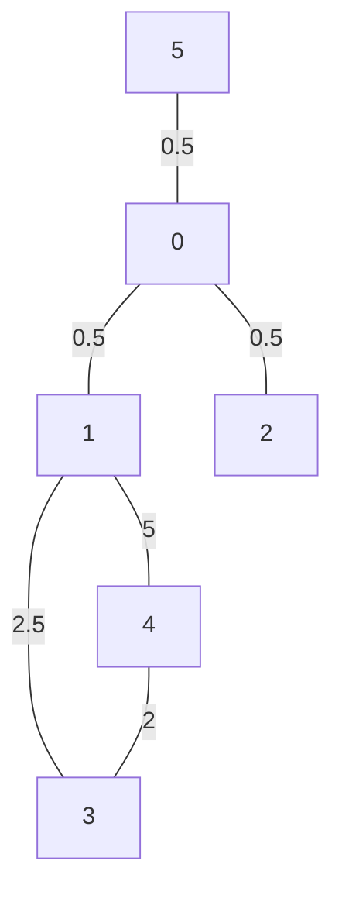

# go-graph-explorer

go-graph-explorer is a library for graph exploration. 

Currently support the next algorithms:

- A*
* BranchAndBonud
+ DepthFirst
- Climbing 
* Amplitude
+ BestFirst

## Install
```go
    go get -u github.com/lucastomic/go-graph-explore
```

## Usage
 
Import the go-graph-explorer package 

```go
import (
    "github.com/lucastomic/go-graph-explorer/pkg/explorator/explorationAlgorithm/enums/informedAlgorithm"
    "github.com/lucastomic/go-graph-explorer/pkg/explorator/explorationAlgorithm/enums/uninformedAlgorithm"
    "github.com/lucastomic/go-graph-explorer/pkg/explorator/explorer"
)
```

Define the graph we want to explore:



```go
var maxF float64 = math.MaxFloat64
var testGraph [][]float64 = [][]float64{
	{maxF, 0.5, 0.5, maxF, maxF, 0.5},
	{0.5, maxF, maxF, 2.5, 5, maxF},
	{0.5, maxF, maxF, maxF, maxF, maxF},
	{maxF, 2.5, maxF, maxF, 2, maxF},
	{maxF, 5, maxF, 2, maxF, maxF},
	{0.5, maxF, maxF, maxF, maxF, maxF},
}
```

Define our heuristic
```go
// Heuristic which dislikes 1
type Dislike1Heur struct{}
func (h Dislike1Heur) Heuristic(state int) float64 {
	if state == 1 {
		return 10
	} else {
		return 1
	}
}
```

Define the solution condition
```go
type ThreeSolution struct {
}

func (s ThreeSolution) IsSolution(state int, graph [][]float64) bool {
	return state == 3
}
```
and finally explore the graph. We can do it with an informed algorithm

```go
res, _ := explorer.ExploreWithInformed(testGraph, ThreeSolution{}, Dislike1Heur{}, 5, informedAlgorithm.AStar)
// explorer.ExploreWithInformed(testGraph, ThreeSolution{}, Dislike1Heur{}, 5, informedAlgorithm.Climbing)
// explorer.ExploreWithInformed(testGraph, ThreeSolution{}, Dislike1Heur{}, 5, informedAlgorithm.BestFirst)
fmt.Println(res.ToString())
```

or with a uninformed one

```go
res2, _ := explorer.ExploreWithUninformed(testGraph, ThreeSolution{}, 5, uninformedAlgorithm.Amplitude)
// explorer.ExploreWithUninformed(testGraph,ThreeSolution{},5,uninformedAlgorithm.DepthFirst)
// explorer.ExploreWithUninformed(testGraph,ThreeSolution{},5,uninformedAlgorithm.BranchAndBonud)
fmt.Println(res2.ToString())
```

Output:
```
5 -> 0 -> 1 -> 3
```
